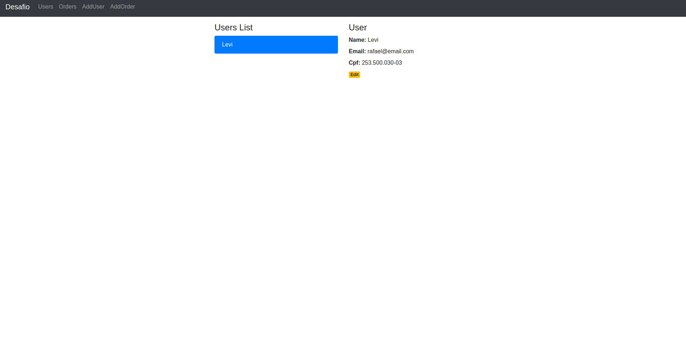

# Front - React.js

back-end: https://github.com/rafaellevissa/desafio-rubyonrails

### Tecnologias utilizadas

- React.js 

### Comandos

Primeiro passo é rodar o comando para instalar as dependências:
```
yarn install ou npm install
```
Para subir a aplicação:
```
yarn start ou npm start
```
List Orders:


List Users:


Edit Orders:


Edit User:

